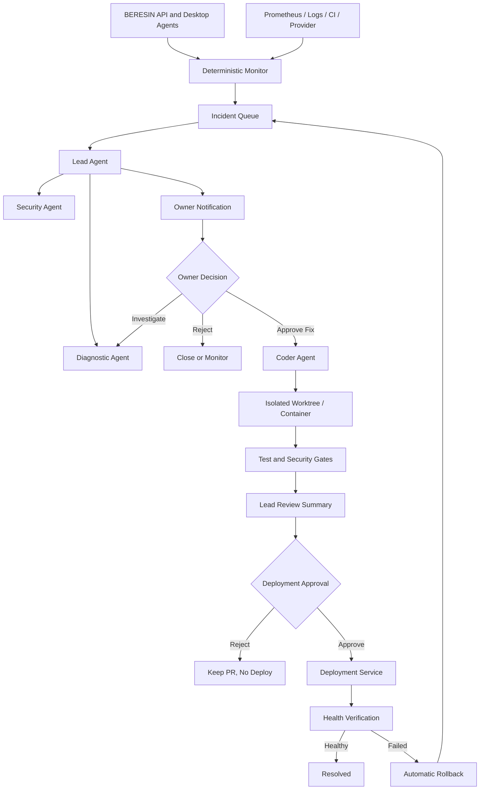

# BERESIN AI Operations Center — Full Implementation Plan

Status: Phase 1-2 implemented; later Hermes execution, remote notifications, PR automation, and deployment automation remain planned  
Scope: Background monitoring, multi-agent incident response, human approval, code remediation, and remote operations  
Target: Local pilot first, production server afterward

Implemented in the current local pilot:

- server-enforced Lead, Security, Diagnostic, and Coder boundaries;
- isolated-worktree and approval requirements encoded as immutable Operations Center policies;
- incident database, deduplication engine, severity, status, notifications, and audit timeline;
- authenticated monitor ingestion for readiness, agent, task, queue, provider, CI, security, disk, and backup signals;
- supervisor incident, proposal, approval, policy, notification, and emergency-pause APIs;
- responsive Operations Center UI with health summary, incident review, timeline, approvals, agent boundaries, and emergency pause;
- agent polling and automatic tool execution fail closed while emergency pause is active.

## 1. Objective

Build an operations layer behind BERESIN that can run continuously, detect failures, coordinate specialized AI agents, notify the owner, and prepare safe code fixes only after explicit approval.

The system must:

- monitor BERESIN continuously without continuously spending LLM tokens;
- wake AI agents only for meaningful incidents or scheduled analysis;
- provide Lead, Diagnostic, Security, and Coder roles with separate permissions;
- let agents exchange structured messages through a durable incident workflow;
- notify the owner remotely;
- require human approval before code changes and deployment;
- run code changes inside an isolated Git worktree/container;
- preserve audit evidence for every decision, tool call, approval, test, and deployment;
- fail closed when authentication, policy, or agent state is uncertain.

## 2. Recommended Technology

| Concern | Recommended component |
|---|---|
| User-facing control | BERESIN AI Operations Center web dashboard |
| Agent runtime | Official Nous Research Hermes Agent |
| Durable orchestration | BERESIN control plane and database-backed incident queue |
| Local pilot remote access | Tailscale Serve |
| Production remote access | HTTPS domain with Cloudflare Access or organization SSO |
| Urgent notifications | Telegram initially; Slack or Microsoft Teams later |
| Metrics | Prometheus |
| Dashboards and alert routing | Grafana |
| Application error tracking | Sentry-compatible error ingestion or BERESIN incident collector |
| Source changes | Isolated Git worktree and pull request |
| CI and deployment approval | GitHub Actions and protected environments |
| Secrets | Production secret manager or protected server secret files |

Hermes is used as an agent runtime, tool host, memory/skills system, messaging gateway, and scheduled-agent runner. BERESIN remains the source of truth for identity, authorization, incidents, approvals, audit, and deployment state.

Hermes delegation is not treated as a durable workflow queue. Long-running ownership and agent-to-agent communication are persisted by BERESIN.

## 3. High-Level Architecture



## 4. Agent Roles and Permissions

### 4.1 Monitor

The Monitor is deterministic software, not an always-running LLM.

Responsibilities:

- poll `/health`, `/ready`, queue status, provider status, disk capacity, database integrity indicators, and agent heartbeat state;
- ingest server exceptions, failed tasks, repeated provider errors, CI failures, and security alerts;
- group repeated signals into one incident;
- apply severity and deduplication rules;
- wake the Lead Agent only when action is required;
- resolve transient alerts automatically after a stable recovery window.

Permissions:

- read health, metrics, sanitized logs, and task status;
- create/update incidents;
- no terminal, filesystem mutation, code changes, secrets, or deployment.

### 4.2 Lead Agent

Responsibilities:

- summarize the incident in plain Indonesian;
- assess impact, confidence, severity, and likely causes;
- request bounded analysis from Diagnostic and Security agents;
- propose one or more actions with risks and rollback options;
- notify the owner and wait for a decision;
- review Coder output and present the final deployment decision.

Permissions:

- read incident evidence, sanitized logs, monitoring context, repository metadata, and agent reports;
- create agent assignments and approval requests;
- no direct source edits, production terminal, secret access, merge, or deployment.

### 4.3 Diagnostic Agent

Responsibilities:

- reproduce failures in a disposable environment;
- inspect relevant logs and source code;
- identify root cause and affected components;
- create a reproduction recipe and recommended test;
- return evidence to Lead.

Permissions:

- read-only repository checkout;
- sanitized runtime logs;
- disposable test environment;
- no production mutation, secret access, merge, or deployment.

### 4.4 Security Agent

Responsibilities:

- classify security impact;
- inspect dependency, secret scanning, authentication, authorization, filesystem boundaries, and audit implications;
- flag prompt injection, credential exposure, privilege escalation, and unsafe agent instructions;
- define security tests required before release.

Permissions:

- read-only repository and security reports;
- run approved scanners in an isolated environment;
- no source edits, production access, secret values, merge, or deployment.

### 4.5 Coder Agent

Responsibilities:

- work only after an approved fix request;
- create a dedicated branch/worktree;
- implement the smallest justified change;
- add regression tests;
- run test, lint, type, build, dependency, and security checks;
- produce a commit and pull request or reviewable patch;
- report changed files, tests, residual risks, and rollback instructions.

Permissions:

- write only inside its assigned isolated worktree;
- no production filesystem, employee files, personal home folders, or direct secret access;
- no direct push to protected `main` unless repository policy explicitly allows the automation identity;
- no merge or deployment approval.

### 4.6 Deployment Service

The deployment component is deterministic automation, not an AI role.

Permissions:

- consume only approved immutable artifacts/commits;
- deploy only to the selected environment;
- run health verification;
- rollback to the prior immutable version when verification fails;
- cannot change source code or approval records.

## 5. Incident Lifecycle

```text
DETECTED
  -> TRIAGING
  -> WAITING_OWNER_DECISION
  -> APPROVED_FOR_FIX | REJECTED | MONITORING
  -> FIX_IN_PROGRESS
  -> FIX_VALIDATION
  -> WAITING_DEPLOYMENT_APPROVAL
  -> DEPLOYING
  -> VERIFYING
  -> RESOLVED | ROLLED_BACK | FAILED
```

Rules:

- every transition is append-only in the audit log;
- only permitted roles can perform each transition;
- approval records are immutable snapshots with expiry and idempotency keys;
- code approval and deployment approval are separate decisions;
- an agent cannot approve its own work;
- stale or changed approval payloads are rejected;
- retries reuse the incident and idempotency key instead of creating duplicate work.

## 6. Incident Severity

| Level | Meaning | Default behavior |
|---|---|---|
| SEV-1 | Security incident, data loss risk, or full outage | Notify immediately; freeze automated mutation; require owner response |
| SEV-2 | Major feature unavailable or many users affected | Notify immediately; Lead investigation starts |
| SEV-3 | Partial degradation, repeated task failures, provider instability | Group and notify; investigation may start automatically read-only |
| SEV-4 | Warning, capacity trend, flaky test, non-urgent maintenance | Add to daily digest |

Initial alert examples:

- `/ready` fails for more than two consecutive checks;
- agent heartbeat missing beyond threshold;
- task failure rate exceeds threshold;
- queue age or depth exceeds threshold;
- repeated approval execution failures;
- AI provider error/latency threshold exceeded;
- database integrity, lock timeout, disk, or backup failure;
- GitHub CI/security workflow failure;
- dependency or secret scanner alert;
- rollback or deployment verification failure.

## 7. Agent-to-Agent Communication

Agents communicate through structured durable messages, not uncontrolled shared chat.

Required message fields:

```json
{
  "incident_id": 123,
  "sender_role": "LEAD",
  "recipient_role": "SECURITY",
  "message_type": "ANALYSIS_REQUEST",
  "summary": "Repeated authorization failures after release",
  "evidence_refs": ["log:abc", "task:456"],
  "requested_action": "Assess authentication and data exposure risk",
  "constraints": ["read_only", "no_secrets"],
  "correlation_id": "uuid",
  "created_at": "ISO-8601"
}
```

Messages must reference evidence by ID. Raw secrets and complete employee documents must never be copied into agent messages.

## 8. Human Approval Design

The owner receives an incident card containing:

- incident title and severity;
- first detected time and current duration;
- affected service, feature, users, and devices;
- sanitized evidence;
- Lead confidence and root-cause hypothesis;
- Security assessment;
- proposed change scope;
- expected benefit and possible side effects;
- tests to run;
- rollback plan;
- estimated model/compute cost;
- `Approve investigation`, `Approve fix`, `Reject`, and `Snooze` actions.

Before deployment, a second card shows:

- exact commit and pull request;
- changed files and diff summary;
- automated checks;
- unresolved warnings;
- deployment target;
- immutable artifact identifier;
- rollback version;
- `Approve deployment` and `Reject deployment` actions.

High-risk approvals require recent re-authentication or MFA.

## 9. AI Operations Center UI

### 9.1 Overview

- overall system status;
- active incidents by severity;
- online/offline agent roles;
- BERESIN device health;
- task success rate and queue latency;
- AI provider availability and latency;
- latest deployment and backup status;
- pending owner approvals.

### 9.2 Incident Detail

- chronological timeline;
- evidence and sanitized logs;
- Lead summary;
- Diagnostic and Security reports;
- agent-to-agent message timeline;
- owner decisions;
- current worktree/PR and CI state;
- deployment and verification results.

### 9.3 Agent Directory

- agent name and role;
- enabled/paused state;
- model and provider policy;
- tool allowlist;
- repository/environment scope;
- last activity and current assignment;
- token/cost usage;
- health and failure count.

### 9.4 Approvals

- pending, approved, rejected, expired, and cancelled requests;
- risk badge and scope;
- immutable request hash;
- approver identity and timestamp;
- review and decision history.

### 9.5 Changes and Deployments

- branch, commit, pull request, and artifact;
- diff and test results;
- security findings;
- deployment status;
- health verification and rollback controls.

### 9.6 Audit

- filter by incident, user, agent, role, tool, action, and time;
- export sanitized audit evidence;
- append-only display with integrity verification status.

## 10. Suggested Database Model

New tables:

- `ops_agents`: role, state, model policy, tool policy, environment scope;
- `ops_incidents`: severity, status, fingerprint, summary, affected resources;
- `ops_incident_events`: append-only state and evidence timeline;
- `ops_agent_assignments`: incident, role, objective, constraints, state, attempt;
- `ops_agent_messages`: structured durable inter-agent communication;
- `ops_evidence`: sanitized evidence metadata and protected content reference;
- `ops_action_proposals`: Lead-proposed investigation/fix/deployment actions;
- `ops_approvals`: immutable human decisions and snapshot hashes;
- `ops_code_changes`: worktree, branch, commit, PR, base revision, status;
- `ops_check_runs`: tests, lint, builds, security scans, results;
- `ops_deployments`: environment, artifact, approval, status, rollback target;
- `ops_notifications`: channel, recipient, delivery state, deduplication key;
- `ops_agent_usage`: model, tokens, latency, estimated cost;
- `ops_policies`: thresholds, role permissions, escalation and approval rules.

Existing BERESIN user/device/task/approval/audit tables remain authoritative for user-facing file operations. Operations Center approval records must not bypass those controls.

## 11. API Plan

Suggested supervisor endpoints:

```text
GET    /api/supervisor/ops/overview
GET    /api/supervisor/ops/incidents
GET    /api/supervisor/ops/incidents/{id}
POST   /api/supervisor/ops/incidents/{id}/decisions
POST   /api/supervisor/ops/incidents/{id}/assignments
GET    /api/supervisor/ops/incidents/{id}/events
GET    /api/supervisor/ops/incidents/{id}/messages
GET    /api/supervisor/ops/agents
PATCH  /api/supervisor/ops/agents/{id}
GET    /api/supervisor/ops/approvals
POST   /api/supervisor/ops/approvals/{id}/respond
GET    /api/supervisor/ops/changes/{id}
GET    /api/supervisor/ops/deployments
POST   /api/supervisor/ops/deployments/{id}/approve
POST   /api/supervisor/ops/deployments/{id}/rollback
GET    /api/supervisor/ops/audit
```

Internal service endpoints:

```text
POST   /api/internal/ops/signals
POST   /api/internal/ops/agent-events
POST   /api/internal/ops/check-results
POST   /api/internal/ops/deployment-results
POST   /api/internal/ops/heartbeats
```

Internal APIs require service identity, short-lived credentials, replay protection, idempotency, rate limits, and schema validation.

## 12. Hermes Integration

Use the official `NousResearch/hermes-agent` source pinned to an immutable release or verified commit.

Create separate Hermes profiles:

```text
beresin-lead
beresin-diagnostic
beresin-security
beresin-coder
```

Each profile must have:

- a dedicated system prompt and role definition;
- a separate tool allowlist;
- an isolated memory namespace;
- a bounded token/time budget;
- an explicit repository/environment scope;
- no `--yolo` mode;
- a BERESIN MCP/API adapter that exposes only role-permitted operations.

Required BERESIN tools exposed to Hermes:

- `get_incident`;
- `list_incident_evidence`;
- `submit_agent_report`;
- `send_agent_message`;
- `request_owner_approval`;
- `get_approval_status`;
- `create_isolated_worktree` (Coder only after approval);
- `run_check_suite` (Coder/Security scope);
- `publish_change_for_review`;
- `request_deployment_approval` (Lead only);
- no unrestricted production shell.

Hermes Gateway runs as a managed service. Scheduled tasks handle periodic reviews and digests. Event-triggered incidents are dispatched by the BERESIN control plane.

## 13. Remote Control

### Local pilot

- keep BERESIN bound to `127.0.0.1`;
- expose Operations Center through Tailscale Serve;
- allow only the owner's tailnet identity;
- use Telegram for notification summaries and deep links;
- use Tailscale SSH only for technical recovery, not normal approval.

### Production

- deploy BERESIN and Operations Center to a managed Linux server;
- expose `ops.<domain>` through HTTPS;
- protect with Cloudflare Access or organization SSO;
- require MFA for supervisor and deployment actions;
- restrict internal metrics, agent APIs, and SSH to a private network;
- never expose SQLite, Prometheus, Hermes Gateway, or agent control ports publicly.

Telegram messages must not contain secrets, raw logs, employee document content, or direct unauthenticated approval buttons. They should link to an authenticated incident page.

## 14. Security Requirements

- default deny for tools, network, filesystem, and deployment;
- role-based capabilities enforced server-side, not only in prompts;
- isolated worktree/container for every Coder assignment;
- no personal employee filesystem access for operations agents;
- secrets injected only at execution time and never copied to model context;
- output redaction before evidence reaches an LLM;
- prompt-injection filtering for logs, issue text, repository content, and external messages;
- signed or hashed approval snapshots;
- short-lived service credentials and key rotation;
- outbound network allowlists where practical;
- dependency and container scanning;
- audit integrity and retention controls;
- maximum concurrency, recursion depth, token, runtime, and spending limits;
- emergency kill switch to pause all agent actions;
- incident freeze mode that allows monitoring but blocks mutation/deployment.

## 15. Observability

Metrics:

- API availability and latency;
- task success/failure/cancellation rate;
- queue depth and oldest-job age;
- Desktop Agent online/offline count;
- approval age and expiry count;
- AI provider latency/error/retry/token usage;
- incident count by severity/status;
- agent assignment runtime and success rate;
- CI/check success rate;
- deployment and rollback count;
- database size/locks;
- disk, memory, and CPU;
- backup age and restore verification age;
- notification delivery failures.

Logs must be structured, correlated by incident/task/agent IDs, sanitized, and retained according to policy.

Every monitoring component also requires meta-monitoring so alerting failure itself is detectable.

## 16. Notifications

Initial Telegram messages:

```text
[SEV-2] BERESIN task failure rate increased
Affected: file operations on 3 devices
Lead assessment: provider requests succeed; agent job result handling is failing
Risk: approved operations may remain incomplete
Recommendation: approve isolated diagnosis
[Open Operations Center]
```

Notification rules:

- SEV-1/SEV-2 immediately;
- SEV-3 grouped to prevent spam;
- SEV-4 daily digest;
- reminders only when approval is still actionable;
- recovery notification after a stable healthy interval;
- Telegram failure falls back to email or another configured channel.

## 17. Coder Workflow

1. Receive an approved immutable fix proposal.
2. Resolve exact repository and base commit.
3. Create `codex/incident-<id>-<slug>` in an isolated worktree.
4. Reproduce the failure before editing.
5. Implement the minimum fix.
6. Add a regression test.
7. Run scoped tests, then the complete required gate.
8. Run dependency, secret, static-analysis, and container checks where relevant.
9. Commit with incident metadata.
10. Open a pull request or produce a reviewable patch.
11. Return evidence to Lead.
12. Wait for deployment approval.

Coder must never:

- modify the production checkout directly;
- merge its own pull request;
- suppress failing security checks;
- weaken approval/path/RBAC controls to make tests pass;
- read or alter employee personal files;
- deploy directly.

## 18. Deployment Workflow

Environments:

```text
development -> test -> staging -> production
```

Production gate:

- approved pull request;
- required CI checks green;
- security workflow green;
- immutable image/artifact built;
- database migration reviewed and backed up;
- owner deployment approval;
- health/readiness and smoke test after deploy;
- automatic rollback criteria configured.

## 19. Testing Strategy

### Unit and policy tests

- role/tool permission matrix;
- incident deduplication and severity;
- immutable approvals and expiry;
- prompt and evidence redaction;
- state-machine transitions;
- cost/concurrency limits;
- deployment self-approval rejection.

### Integration tests

- monitoring signal creates one incident;
- Lead requests Diagnostic/Security reports;
- owner rejection prevents Coder creation;
- owner approval creates isolated worktree;
- Coder cannot access production or employee folders;
- check failure blocks deployment;
- deployment approval requires correct role/MFA state;
- rollback is triggered on failed verification;
- agent restart resumes durable assignments without duplicate actions.

### Failure drills

- BERESIN API unavailable;
- database lock/corruption warning;
- AI provider unavailable or slow;
- Hermes Gateway restart;
- Telegram delivery failure;
- GitHub CI outage;
- malformed or prompt-injected log entry;
- secret accidentally appears in input evidence;
- disk full;
- deployment health failure;
- network interruption during an approved action.

### Security validation

- SAST, dependency, secret, and container scans;
- authorization tests for every endpoint;
- replay and idempotency tests;
- cross-incident and cross-user isolation;
- penetration test before public exposure;
- restore and rollback evidence.

## 20. Implementation Phases

### Phase 0 — Decisions and threat model

- finalize agent roles and authority;
- choose Telegram account/channel and remote access mode;
- define incident severities and owner identity;
- document threat model, protected assets, and failure boundaries;
- pin the official Hermes version.

Exit criteria: approved architecture and security policy.

### Phase 1 — Deterministic monitoring foundation

- add incident/event schema;
- create monitoring signal ingestion;
- implement deduplication, severity, recovery, and retention;
- connect existing BERESIN metrics, readiness, tasks, devices, provider, CI, backup, and disk status;
- build incident list/detail API.

Exit criteria: incidents are created and resolved without any LLM.

### Phase 2 — Operations Center MVP

- build supervisor Overview, Incidents, Incident Detail, and Approvals pages;
- implement realtime incident updates;
- add audit timeline and sanitized evidence viewer;
- add emergency pause/freeze control.

Exit criteria: owner can inspect and decide an incident locally.

### Phase 3 — Lead and Security agents

- install pinned official Hermes on a separate runtime;
- create BERESIN MCP/API adapter;
- configure Lead and Security profiles/tool policies;
- implement durable assignments and structured reports;
- add token/runtime/concurrency limits.

Exit criteria: an incident produces a safe Lead summary and Security report with no mutation rights.

### Phase 4 — Remote notifications and access

- configure Telegram notification delivery;
- configure Tailscale Serve for local pilot;
- add authenticated deep links to incident pages;
- test notification failure fallback and account revocation.

Exit criteria: owner can receive and review an incident remotely.

### Phase 5 — Diagnostic and Coder agents

- configure read-only Diagnostic profile;
- implement approved worktree provisioning;
- configure Coder tool and filesystem restrictions;
- implement reproduction, regression test, commit, and PR workflow;
- show diff and check results in Operations Center.

Exit criteria: approved incidents create reviewable code changes without touching production.

### Phase 6 — Deployment approval and rollback

- configure protected CI/deployment environments;
- implement immutable artifact tracking;
- add second owner approval;
- implement health verification and automatic rollback;
- record complete deployment audit.

Exit criteria: no production deployment occurs without green checks and explicit approval.

### Phase 7 — Production hardening

- deploy to staging with production-like TLS, SSO/MFA, secrets, monitoring, and backups;
- run load, restart, outage, restore, rollback, and penetration drills;
- define support rotation, cost budgets, and incident retention;
- complete release checklist and operational sign-off.

Exit criteria: production gate passes with current evidence.

## 21. Recommended Build Order

1. Incident database and deterministic monitor.
2. Operations Center incident UI.
3. Human approval state machine.
4. Telegram notifications and authenticated deep links.
5. Hermes Lead integration.
6. Hermes Security and Diagnostic integrations.
7. Isolated Coder workflow.
8. GitHub pull request and CI integration.
9. Deployment approval and rollback.
10. Grafana/Prometheus production dashboards.
11. Remote production access with SSO/MFA.
12. Full staging drills and security review.

Do not begin with an autonomous Coder. Monitoring, incident persistence, permissions, and human approval must exist first.

## 22. MVP Definition

The first useful release includes:

- deterministic health monitoring;
- incident creation and deduplication;
- Lead analysis on demand;
- Telegram notification;
- Operations Center incident detail;
- owner Approve/Reject decision;
- audit trail;
- no autonomous code changes yet.

The second release adds Diagnostic, Security, and isolated Coder workflows.

## 23. Production Readiness Checklist

- [ ] Official Hermes release/commit pinned and verified
- [ ] Role and tool policies enforced server-side
- [ ] Incident state machine and idempotency tested
- [ ] Secrets absent from prompts, memory, logs, and repository
- [ ] Operations Center protected by SSO/MFA
- [ ] Telegram contains no sensitive evidence or direct insecure approval
- [ ] Coder isolated from production and employee files
- [ ] Branch protection and required CI/security checks enabled
- [ ] Separate code and deployment approvals enforced
- [ ] Immutable artifacts and rollback tested
- [ ] Metrics, alerts, and meta-monitoring enabled
- [ ] Backup/restore drill completed
- [ ] Provider outage and agent restart drills completed
- [ ] Load and concurrency limits validated
- [ ] Cost and token budgets configured
- [ ] Audit retention and privacy policy approved
- [ ] Emergency pause and freeze mode tested
- [ ] Penetration test completed before public exposure

## 24. Non-Goals

- agents approving their own changes;
- autonomous production deployment without a human decision;
- unrestricted shell or root access;
- copying employee documents into agent memory;
- using Telegram as the authoritative approval store;
- keeping multiple LLM sessions continuously generating output 24/7;
- replacing deterministic health checks with AI judgment;
- relying on Hermes transient subagents as the durable workflow database.

## 25. Initial Success Metrics

- incident detection within 60 seconds;
- SEV-1/SEV-2 owner notification within 2 minutes;
- duplicate alert reduction above 90%;
- zero unapproved source or production mutations;
- 100% of changes linked to incident, approval, commit, and check evidence;
- 100% rollback availability for production releases;
- agent analysis failure does not affect core BERESIN file operations;
- monthly token/compute spending remains inside configured budget;
- mean time to diagnose and recover improves across pilot incidents.

## 26. Key Decisions Required Before Implementation

1. Where the pilot Hermes runtime will run: this Mac, a separate local machine, or a small Linux VPS.
2. Notification channel: Telegram first, or the organization's Slack/Teams.
3. GitHub repository visibility and plan, because protected deployment approval features vary by plan.
4. Whether Coder may open pull requests automatically or only produce local patches initially.
5. Who can approve investigation, code changes, and production deployment.
6. Production identity provider and MFA method.
7. Log, incident, audit, and agent-memory retention periods.
8. Monthly AI/provider budget and maximum concurrent agents.
9. Staging and production server topology.
10. Whether the first release stops at monitoring/notification or includes Coder automation.

## 27. Official References

- Hermes Agent: <https://github.com/NousResearch/hermes-agent>
- Hermes documentation: <https://hermes-agent.nousresearch.com/docs/>
- Hermes cron: <https://hermes-agent.nousresearch.com/docs/user-guide/features/cron/>
- Tailscale Serve: <https://tailscale.com/docs/features/tailscale-serve>
- Tailscale SSH: <https://tailscale.com/kb/1193/tailscale-ssh>
- Cloudflare Tunnel: <https://developers.cloudflare.com/tunnel/setup/>
- Grafana Alerting: <https://grafana.com/docs/grafana/latest/alerting/>
- GitHub deployment environments: <https://docs.github.com/en/actions/reference/workflows-and-actions/deployments-and-environments>
